.. _cellmlrepositorytutorial:

==========================================================
Tutorial on using CellML with Auckland Physiome Repository
==========================================================

.. sectionauthor:: David Nickerson, Randall Britten, Dougal Cowan

.. _teaching instance: http://teaching.physiomeproject.org

About this tutorial
===================

The Auckland Physiome Repository provides extensive support for CellML
model and related files.  Previously it was called the CellML Model
Repository, this has since been merged completely along with the FieldML
Model Repository into the unified repository.  The underlying software
is :term:`PMR2`, which in turn relies on the distributed version control
system :term:`Mercurial` (Hg), which allows the repository to maintain a
complete history of all changes made to every file it contains. This
tutorial demonstrates how to work with the repository using TortoiseHg,
which provides a Windows explorer integrated system for working with
Mercurial repositories.

::

  Brief mention of the equivalent command line versions of the
  TortoiseHg actions will also be mentioned, so that these ideas can
  also be used without a graphical client, and on Linux and similar
  systems. These will be denoted by boxes like this.

This tutorial requires you to have:

- A Mercurial client such as `TortoiseHg
  <http://tortoisehg.bitbucket.org/>`_ or `Mercurial
  <http://mercurial.selenic.com/>`_ installed
- The `OpenCell <http://www.cellml.org/tools/opencell>`_ CellML
  modelling environment
- A text editor such as `Notepad++ <http://notepad-plus-plus.org/>`_ or
  `gedit <http://projects.gnome.org/gedit/>`_

Basic concepts
==============

The Auckland Physiome Repository use a certain amount of jargon - some
is specific to the repository software, and some is related to
distributed version control systems (DVCSs). Below are basic
explanations of some of these terms as they apply to the repository.

:term:`Workspace`

  A container (much like a folder or directory on your computer) to hold
  the files that make up a model, as well as any other files such as
  documentation or metadata, etc. In practical terms, each workspace is
  a Mercurial repository.

:term:`Exposure`

  An exposure is a publicly viewable presentation of a particular
  revision of a model. An exposure can present one or many files from
  your workspace, along with documentation and other information about
  your model.

The Mercurial DVCS has a range of terms that are useful to know, and
definitions of these terms can be found in the Mercurial glossary:
http://mercurial.selenic.com/wiki/Glossary.

.. index::
   single: Auckland Physiome Repository web interface

Working with the repository web interface
=========================================

This part of the tutorial will teach you how to find models in the
Auckland Physiome Repository `<https://models.physiomeproject.org>`_,
how to view a range of information about those models, and how to
download models. The first page in the repository consists of basic
navigation, a link to the main model listing, a search box at the top
right, and a list of model category links as shown below.

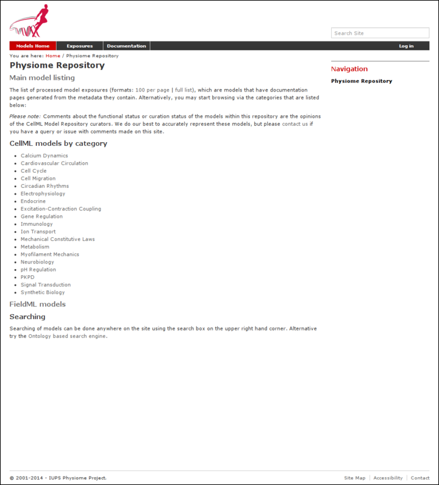

   The front page of the Auckland Physiome Repository.

Model listings
--------------

Clicking on the main model listing or any of the category listings will
take you to a page displaying a list of exposed models in that category.
Click on electrophysiology for example, and a list of over 100 exposed
models in that category will be displayed, as shown here.

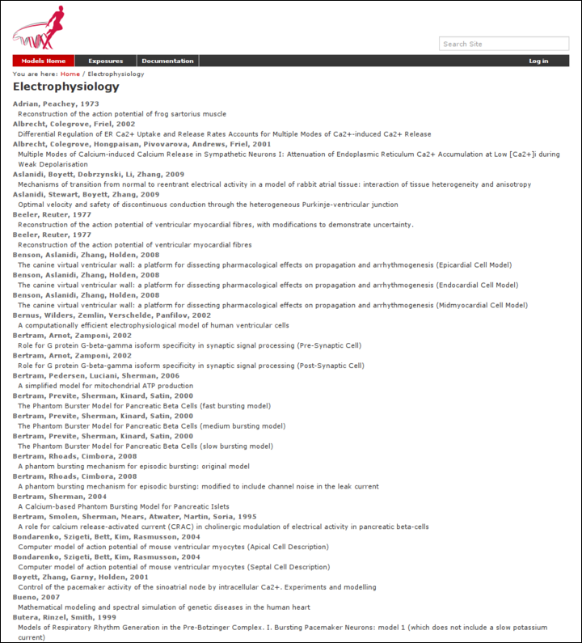

   A list of models in the electrophysiology category.

Clicking on an item in the list will take you to the exposure page for
that model.

Searching the repository
------------------------

You can search for the model that you wish to work on by entering a
search term in the box at the top right of the page. Many of the models
in the repository are named by the first author and publication date of
the paper, so a good search query might be something like `goldbeter
1991`. A list of the results of your search will probably contain both
workspaces and exposures - you will need to click on the workspace of
the model you wish to work on. Workspaces can be identified by where
they are located, as they will be located inside **Workspaces**.
In the following screenshot, the first two results are workspaces, and
the remainder are exposures.  Note that red links are exposures that are
marked as expired.

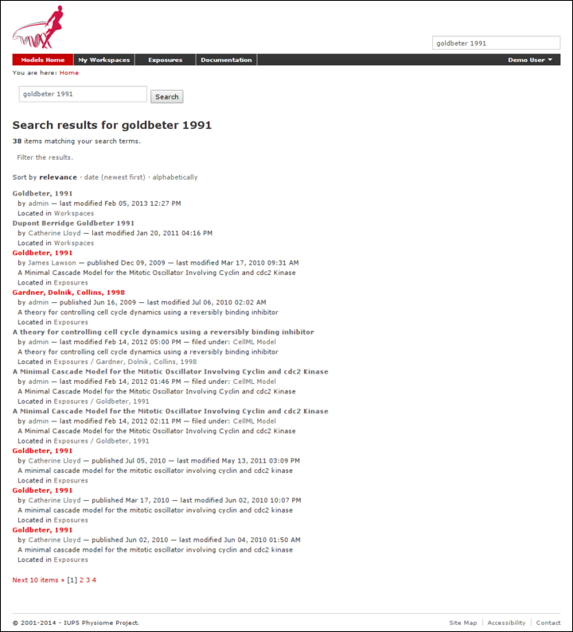

   A search results listing on the Auckland Physiome Repository.

Click on an exposure result to view information about the model and to
get links for downloading or simulating the model. Click on workspaces
to see the contents of the model workspace and the revision history of
the model.

.. _cellmlrepositorytutorial-hg:

Working with the repository using Mercurial
===========================================

This part of the tutorial will teach you how to :term:`clone` a
workspace from the model repository using a Mercurial client, create
your own workspace, and then push the cloned workspace into your new
workspace in the repository. We will be using a :term:`fork` of an
existing workspace, which provides you with a personal copy of a
workspace that you can edit and push changes to.

Registering an account and logging in
-------------------------------------

First, navigate to the `teaching instance`_ of the Auckland Physiome
Repository at `<http://teaching.physiomeproject.org/>`_.

.. include:: teaching-instance-warning.rst

In order to make changes to models in the CellML repository, you must
first register for an account. The *Log in* and *Register* links can be
found near the top right corner of the page. Your account will have the
appropriate access privileges so that you can push any changes you have
made to a model back into the repository.

Click on the Register link near the top right, and fill in the
registration form. Enter your username and desired password. After
completing the email validation step, you can now log in to the
repository.

.. note::

   This username and password are also the credentials you use to
   interact with the repository via Mercurial.

Once logged in to the repository, you will notice that there is a new
link in the navigation bar, My Workspaces. This is where all the
workspaces you create later on will be listed. The Log in and Register
links are also replaced by your username and a Log out link.

Mercurial username configuration
--------------------------------

.. important::
   **Username setup for Mercurial**

   Since you are about to make changes, your name needs to be recorded
   as part of the workspace revision history. When commit your changes
   using Mercurial, it is initially "offline" and independent of the
   Auckland Physiome Repository.  This means that you have to set-up
   your username for the Mercurial client software, even though you have
   registered a username on Auckland Physiome Repository.

   You only need to do this once.

**Steps for TortoiseHg:**

- Right click on any file or folder in Windows Explorer, and select
  :menuselection:`TortoiseHg --> Global Settings`.
- Select *Commit* and then enter your name followed by your e-mail
  address in "angle brackets" (i.e. less-than "<" and greater-than ">").
  Actually, you can enter anything you want here, but this is the
  accepted best practice.  Note that this information becomes visible
  publicly if the workspace that you push your changes to is public.

**Steps for command line:**

- Edit the config text file:
   - For per repository settings, the file in the repository:
     ``<repo>\.hg\hgrc``
   - System-wide settings for Linux: ``%USERPROFILE%\.hgrc``
   - System-wide settings for Windows: ``%USERPROFILE%\mercurial.ini``

- Add the following entry::

   [ui]
   username = Firstname Lastname <firstname.lastname@example.net>

.. _tut1forkingaworkspace:

Forking an existing workspace
-----------------------------

.. important::

   It is essential to use a Mercurial client to obtain models from the
   repository for editing. The Mercurial client is not only able to keep
   track of all the changes you make (allowing you to back-track if you
   make any errors), but using a Mercurial client is the only way to add
   any changes you have made back into the repository.

For this tutorial we will :term:`fork` an existing workspace. This
creates new workspace owned by you, containing a copy of all the files
in the workspace you forked including their complete history. This is
equivalent to cloning the workspace, creating a new workspace for
yourself, and then pushing the contents of the cloned workspace into
your new workspace.

Forking a workspace can be done using the Physiome Model Repository web
interface. The first step is to find the workspace you wish to fork. We
will use the Beeler, Reuter 1977 :term:`workspace` which can be found
at:
`<http://teaching.physiomeproject.org/workspace/beeler_reuter_1977>`_.

Now click on the :guilabel:`fork` option in the toolbar, as shown below.

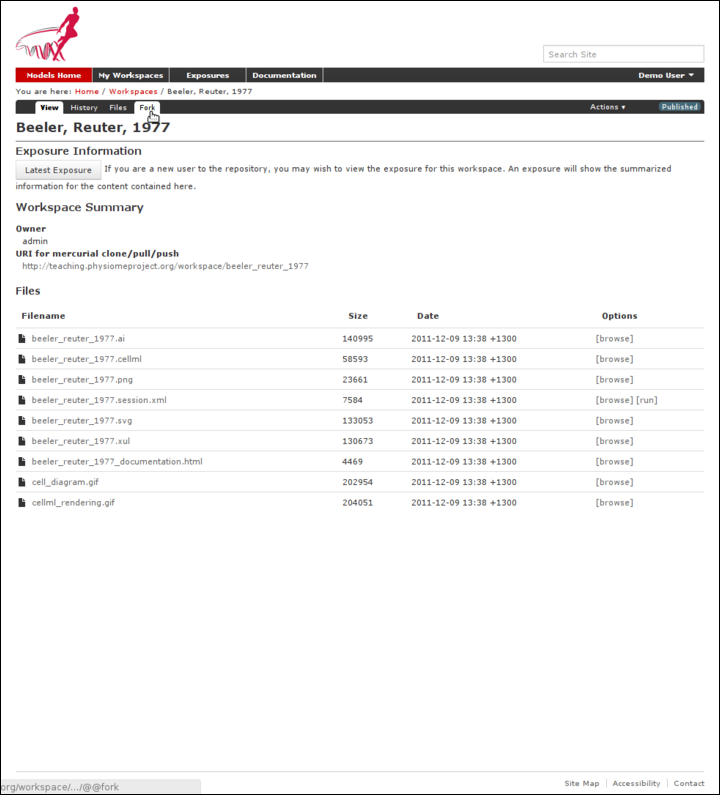

You will be asked to confirm the *fork* action by clicking the
:guilabel:`Fork` button. You will then be shown the page for your forked
workspace.

Cloning your forked workspace
-----------------------------

In order to make changes to your workspace, you have to :term:`clone` it
to your own computer. In order to do this, copy the URI for mercurial
clone/pull/push as shown below:

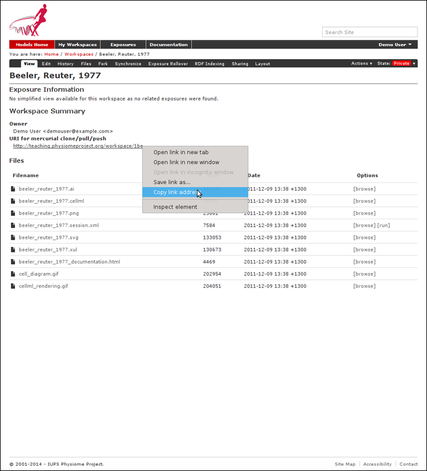

   Copying the URI for cloning your workspace.

In Windows explorer, find the folder where you want to create the clone
of the workspace. Then right click to bring up the context menu, and
select :menuselection:`TortoiseHG --> Clone` as shown below:

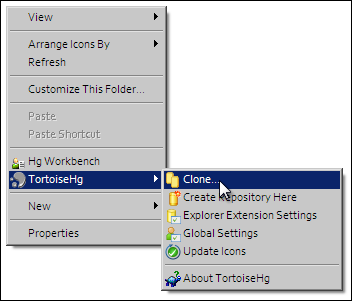

Paste the copied URL into the *Source:* area and then click the *Clone*
button. This will create a folder called ``beeler_reuter_1977_tut`` that
contains all the files and history of your forked workspace. The folder
will be created inside the folder in which you instigated the clone
command.

**Command line equivalent** ::

   hg clone [URI]

You will need to enter your username and password to clone the
workspace, as the fork will be set to *private* when it is created.

The repository will be cloned within the current directory of your
command line window.

Making changes to workspace contents
------------------------------------

Your cloned workspace is now ready for you to edit the model file and
make a commit each time you want to save the changes you have made. As
an example, open the model file in your text editor and remove the
paragraph which describes validation errors from the documentation
section, as shown below:

.. figure:: images/tut1-editcellmlfile.png
   :align: center

Save the file. If you are using TortoiseHg, you will notice that the
icon overlay has changed to a red exclamation mark. This indicates that
the file now has uncommitted changes.

Committing changes
------------------

If you are using TortoiseHg, bring up the shell menu for the altered
file and select :menuselection:`TortoiseHg --> Hg Commit`. A window will
appear showing details of the changes you are about to commit, and
prompting for a commit message. Every time you commit changes, you
should enter a useful commit message with information about what changes
have been made. In this instance, something like "Removed the paragraph
about validation errors from the documentation" is appropriate.

Click on the Commit button at the far left of the toolbar. The icon
overlay for the file will now change to a green tick, indicating that
changes to the file have been committed.

.. figure:: images/tut1-commitchanges.png
   :align: center

**Command line equivalent** ::

   hg commit -m "Removed the paragraph about validation errors from the documentation"

Pushing changes to the repository
---------------------------------

Your cloned workspace on your local machine now has a small history of
changes which you wish to *push* into the repository.

Right click on your workspace folder in Windows explorer, and select
:menuselection:`TortoiseHg --> Hg Synchronize` from the shell menu. This
will bring up a window from which you can manage changes to the
workspace in the repository. Click on the Push button in the toolbar,
and enter your username and password when prompted.

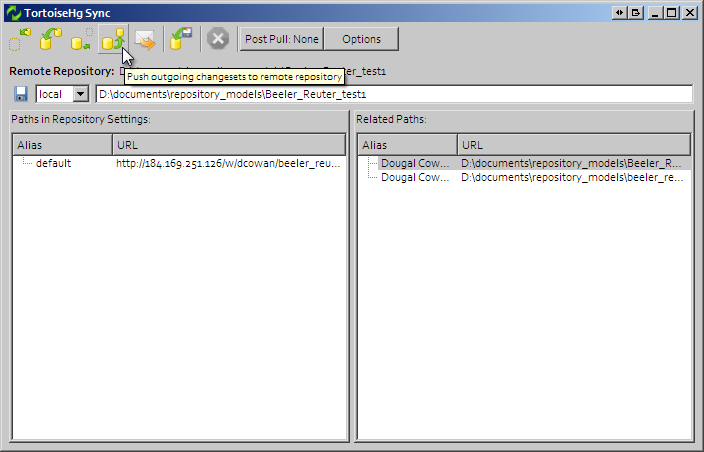

**Command line equivalent** ::

   hg push

Now navigate to your workspace and click on the history toolbar button.
This will show entries under the Most recent changes, complete with the
commit messages you entered for each commit, as shown below:

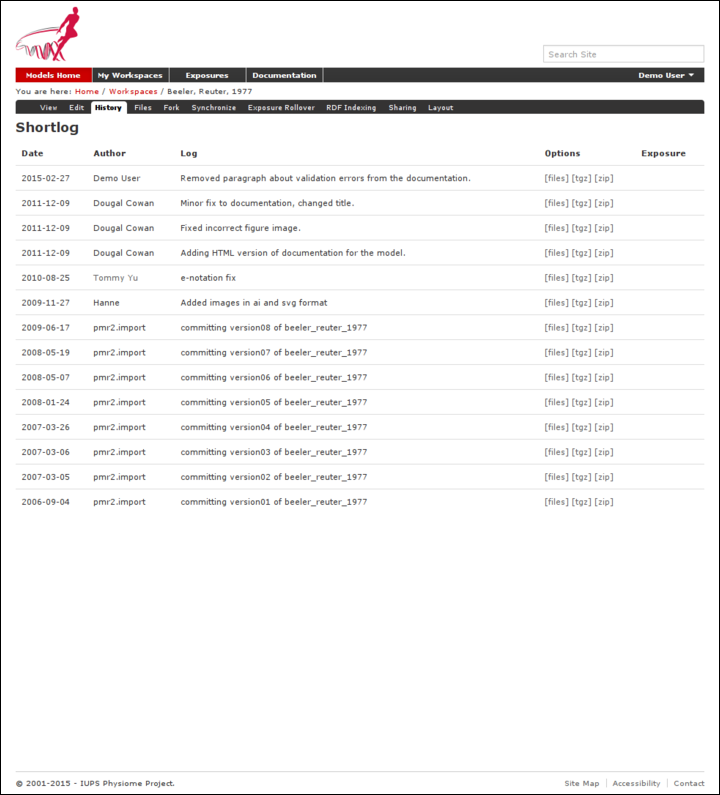

Create an exposure
==================

As explained earlier, an :term:`exposure` aims to bring a particular
revision to the attention of users who are browsing and searching the
repository.

There are two ways of making an exposure - creating a new exposure from
scratch, or "Rolling over" an exposure. Rolling over is used when a
workspace already has an existing exposure, and the updates to the
workspace have not fundamentally changed the structure of the workspace.
This means that all the information used in making the previous exposure
is still valid for making a new exposure of a more recent revision of
the workspace. Strictly speaking, an exposure can be rolled over to an
older revision as well, but this is not the usual usage.

As you are working in a forked repository, you will need to create a new
exposure from scratch. To learn how to create exposures, please refer to
:ref:`exposing-cellml`.

.. _migrating-from-teaching-to-live-repo:

Migrating content to the main repository
========================================

As noted above, the `teaching instance`_ used in this tutorial is not
suitable for permanent storage of your work. One of the advantages of
using a distributed version control system to manage :term:`workspaces`
is that it is straightforward to move the entire workspace, including
the full history and provenance record, from one location to another.
PMR2 also provides a feature that exports exposures so that they can
then be imported into another PMR2 instance.

For example: if you would like to move your work in your workspace on
the teaching instance into a *new* workspace on the Auckland Physiome
Repository (or from one PMR2 instance to another), you should follow
these steps:

1. Ensure that you have pushed all your commits to the source instance;

#. :ref:`Create the new workspace <creatingNewWorkspace>` in the
   destination repository;

#. Navigate to the workspace created and choose the
   :guilabel:`synchronize` action from the workspace toolbar, as shown
   below.

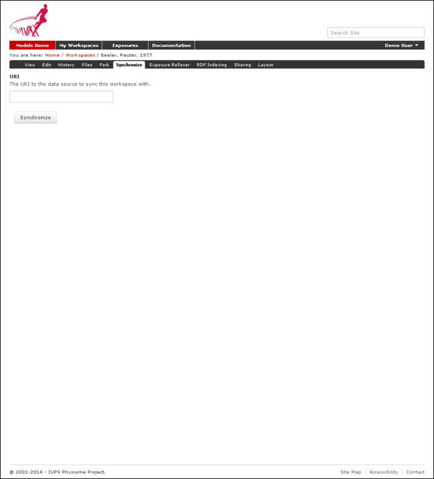

4. Fill in the URI of your workspace on the source instance (*e.g.,*
   `<http://models.physiomeproject.org/w/andre/cortassa-ECME-2006>`_)

#. Click the :guilabel:`Synchronize` button.

.. _exposurewizardimportexport:

In a similar manner, you are able to copy :term:`exposures` you might
have made on the teaching instance over to the main repository, or from
the main to the teaching instance if you want to test things out. Follow
these steps to migrate an :term:`exposure` from one repository to
another.

1. Navigate to the exposure you would like to migrate in the source
   repository.

#. Choose the :guilabel:`wizard` item from the toolbar as shown below.

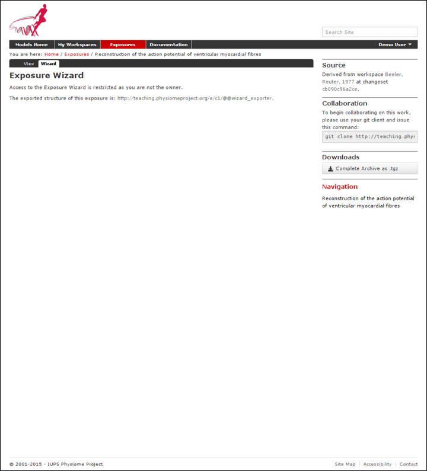

3. In the destination repository, navigate to the desired revision of
   the (published) workspace and choose the :guilabel:`Create exposure`
   action as described in the directions for :ref:`creating an exposure
   from scratch <createExposureChooseRevision>`

#. Rather than building a new exposure, choose the :guilabel:`Exposure
   Import via URI` tab in the exposure creation wizard, as shown below.

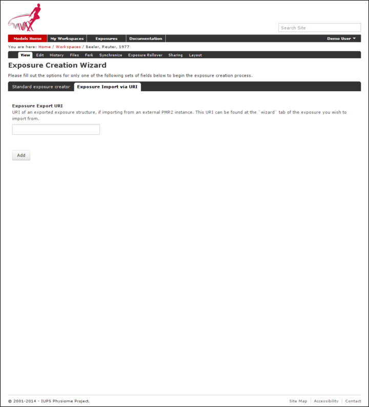

5. Copy and paste the URI from the source exposure wizard, highlighted
   above, into the :guilabel:`Exposure Export URI` field in the exposure
   creation wizard shown above.

#. Click the :guilabel:`Add` button. This will take you back to the
   standard :ref:`exposure build page <buildingTheExposure>`, but now
   with all the fields pre-populated from the source exposure.

#. Navigate to the bottom of the page and click the :guilabel:`Build`
   button to actually build the exposure pages. You are free to
   reconfigure the exposure if desired, some :ref:`help is available
   <buildingTheExposure>` for this if needed.
