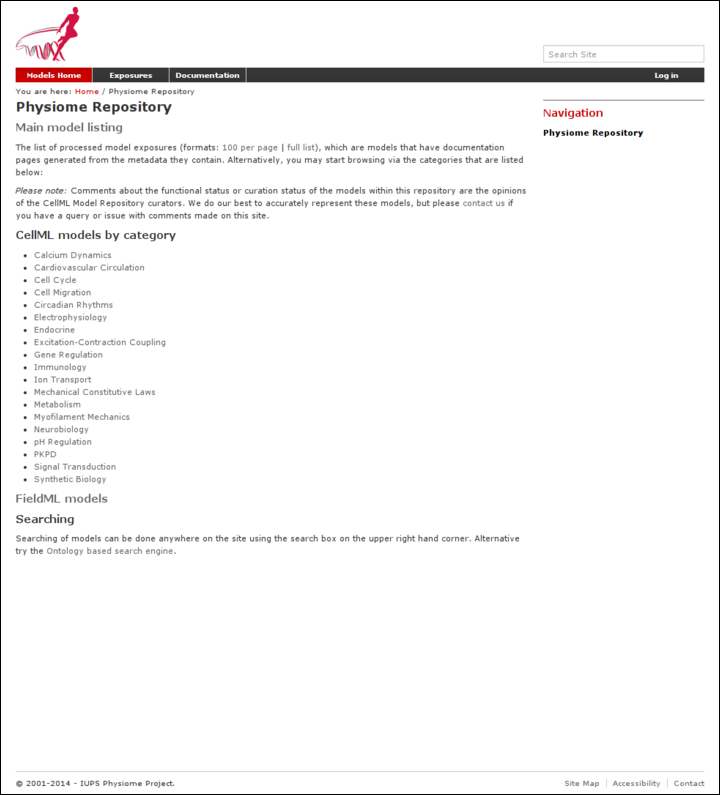
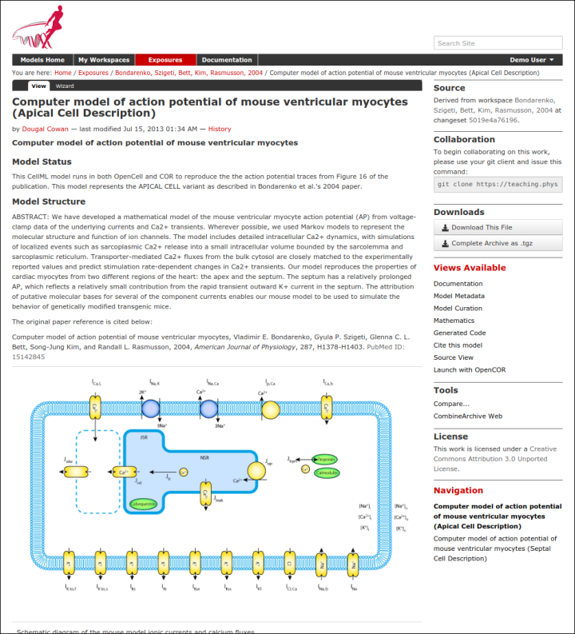

.. _downloading-viewing:

.. _OpenCell: http://www.cellml.org/tools/opencell/

====================================================================
Downloading and viewing models from the Auckland Physiome Repository
====================================================================

There are several ways of obtaining and using models from the Auckland
Physiome Repository, and which you choose will depend on the way you
intend to use the models. If you are simply interested in running a
particular model and viewing the output, you can use links found on
model :term:`exposure` pages to get hold of the model files. There links
available for a large number of models that will load the model directly
into the OpenCell application, allowing you to explore simulation
results with the help of a model diagram.

If you intend to use the model for further work, for example saving
changes to the model or creating a new model based on an existing model
or parts of an existing model, you should use :term:`Mercurial` to
obtain the files. In this way you also obtain the complete revision
history of the files, and can add to this history as you make your own
changes.

Searching the repository
========================

The Auckland Physiome Repository has a basic search function that can be
accessed by typing search terms into the box at the top right hand side
of the page. You can use keywords such as ``cardiac`` or ``insulin``,
author names, or any other terms relevant to the models you want to
find.

   The index page of the model repository provides two methods for
   finding models. There is a box for entering search terms, or you can
   click on categories based on model keywords to see all models in
   those categories.

If your search is yielding too many results, you may either try to
narrow it down by choosing more or different keywords (*eg.* ``goldbeter
1991`` instead of just ``goldbeter``), or you can click the *Advanced
Search* link just under the search box on the results page. This will
take you to a search page where you can select specific item types
(*eg.* exposures or workspaces).

   In this search only exposure related items are to be shown in
   the results.

Once you have found the model you are interested in, there are several
ways you can view or download it.

Viewing models via the respository web interface
================================================

The most common use of the Auckland Physiome Repository web interface is
probably to view information about models found on exposure pages, and
to then download the models from these pages for simulation in a CellML
supporting application.

Below is an example of a CellML exposure page. It contains documentation
about the model(s), a diagram of the what the model(s) represent, and a
navigation pane that allows the user to select between available
versions of the model. Many models only have one version, but in this
case there are two variants.

   An example of a CellML exposure page.

If you click on one of the model variant navigation links, you will be
taken to a sub-page of the exposure which will allow you to view the
actual CellML model in a number of ways.

   An example of a CellML exposure sub-page.

On this page there are a number of options under a *Views available*
panel at the right hand side.

- *Documentation* - displays the model documentation, already visible in
  the main area of the exposure page.
- *Model Metadata* - displays information such as the citation
  information, model authorship details, and keywords.
- *Model Curation* - displays the curation stars for the model, also
  visible at the top right of the page. Future additions to the curation
  system mean that there will be additional information to be displayed
  on this page.
- *Mathematics* - displays all the equations in the model in graphical
  form.
- *Generated code* - shows a page where you can view the model in a
  number of different languages; C, C_IDA, Fortran 77, MATLAB, and
  Python. You can copy the generated code directly from this page to
  paste into your code editor.
- *Cite this model* - this page provides generic information about how
  to cite models in the repository.
- *Source View* - provides a raw view of the CellML (XML) model code.
- *Simulate using OpenCell* - this link will download the model and open
  it with OpenCell_ if you have the software installed. If the model has
  a session file, this will include an interactive diagram which can be
  clicked on to display traces of the simulation results.

The OpenCell session that is loaded when clicking on the Simulate using
OpenCell link looks something like this:

   An OpenCell session. Objects such as membrane channels in the diagram
   can be clicked - this will toggle the graph traces displaying the
   values for those objects.

Downloading models via Mercurial
================================

All data in the Auckland Physiome Repository are stored in
:term:`workspaces` and each :term:`workspace` is a :term:`Mercurial`
repository. The most comprehensive method of downloading content from
Auckland Physiome Repository is to clone the workspace containing the
desired data. In this manner you will have a local copy of the entire
history of that data, including all provenance data, and the ability to
step back through the history of the workspace to a state that may not
be available via the download links in the exposure pages discussed
above. If you would like to modify the contents of workspace, making use
of Mercurial will ensure accurate provenance records are maintained as
well as all the other benefits of using a version control system.

As software tools like `OpenCOR`_ and `MAP Client`_ evolve, they will be
able to hide a lot of the Mercurial details and present the user with a
user interface suitable for their specific application areas. Directly
using Mercurial is, however, currently the most powerful way to leverage
the full capabilities of Auckland Physiome Repository.

If you are using the command line Mercurial client, you can easily clone
the underlying repository for an exposure simply by selecting the text
box inside the **Collaboration** portlet and paste that command into a
terminal, or right click on the name of the workspace under the
**Source** portlet and copy that URL and then paste that into your
Mercurial client.

Detailed instructions for working with Mercurial can be found in the
:ref:`CellML repository tutorial <cellmlrepositorytutorial-hg>`.

.. _OpenCOR: http://abibook2.readthedocs.org/en/latest/OpenCOR/
.. _MAP Client: http://abibook2.readthedocs.org/en/latest/MAP/
