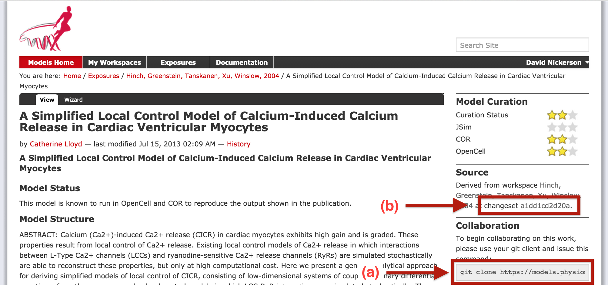

.. _embeddedworkspaces:

==================================
Embedded workspaces and their uses
==================================

.. sectionauthor:: `David Nickerson <http://about.me/david.nickerson>`_

.. warning::
   This section is a work in progress, please `send us <https://models.physiomeproject.org/about/contact>`_ any questions, comments, or issues.

.. todo::
   This section needs more work. Need to add documentation on how to do the examples using a GUI client like TortoiseGit.

:term:`Workspaces` in :term:`PMR` are currently implemented as :term:`Git`
repositories. One Git feature that is quite useful in the context
of the Auckland Physiome Repository is the ability to nest repositories using `Git submodules
<https://git-scm.com/book/en/v2/Git-Tools-Submodules>`_. Using the more
general :term:`PMR2` concepts, we term such nesting as :term:`embedded
workspaces`.

Embedded workspaces:

- are intended to manage the separation of modules or sub-models which are integrated
  to create a model;
- facilitate the sharing and reuse of models and sub-models independently
  from specific instances of a model;
- enable the development of the modules to proceed independently, thus
  the version of the workspaces embedded is also tracked; and
- allow authors to make use of relative URIs when linking between data
  resources providing a file system agnostic method to describe complex
  module relationships in a portable manner.

Workspaces can be embedded at a specific revision or set to track the
most recent revision of the source workspace. Changes made to the source
workspace will not affect any embedding workspace until the author
explicitly chooses to update the embedded workspace. This provides the
author with the opportunity to review the changesets and make an
informed decision regarding alterations to embedded revisions. Any
alterations in the specific revision of an embedded workspace is data
captured in a changeset in the embedding workspace – thus providing a
clear provenance record of the entire dataset in the workspace.

Uses
====

The `Git submodules <https://git-scm.com/book/en/v2/Git-Tools-Submodules>`_ documentation provides detailed information on the use of Git submodules, and the documentation of the `git-submodule <http://git-scm.com/docs/git-submodule>`_ command is also a useful resource. Here we provide some typical examples demonstrating the use of embedded workspaces with PMR. 

Making use of a fixed version of a CellML model
-----------------------------------------------

A common use-case for creating an embedded workspace is when you wish to take a curated CellML model from PMR and use it in your own work. Here we demonstrate how to embed a specific version of a workspace within your own workspace. For our example we have our own workspace in which we are developing a cardiac mechanics model and we now want to couple our mechanics model to a model of cardiac calcium dynamics. 

A popular cardiac calcium dynamics model is that of `Hinch et al (2004) <http://identifiers.org/pubmed/15465866>`_. An encoding of this model in CellML can be found in PMR `here <https://models.physiomeproject.org/exposure/8e1a590fb82a2cab5284502b430c4a4f/hinch_greenstein_tanskanen_xu_winslow_2004.cellml/view>`_. From this page, we are able to find two key pieces of information that we need in order to embed this version of the Hinch *et al* model into our workspace, as shown below, the *source workspace* and the *changeset* identifier.



   The Hinch *et al* (2004) exposure page in PMR, highlighting the **Source** section of the CellML exposure page. 
   
From the **Source** section highlighted above, right-clicking on the workspace link should allow you to easily copy the source workspace URL. You can then navigate to your local :term:`clone` of your workspace you can embed the Hinch *et al* workspace as follows.

::

   $ git submodule add https://models.physiomeproject.org/workspace/hinch_greenstein_tanskanen_xu_winslow_2004
   Cloning into 'hinch_greenstein_tanskanen_xu_winslow_2004'...
   remote: dul-daemon says what
   remote: counting objects: 29, done.
   remote: how was that, then?
   Unpacking objects: 100% (29/29), done.
   Checking connectivity... done.

By default the embedded workspace (Git submodule) will have the same name as the source workspace and be placed in the root of your workspace, but you can provide a different path to the above command if desired.

When the embedded workspace is first created, it will be initialised to the latest version of the workspace, so we now need to :term:`checkout` the specific version of the embedded workspace that we are after (shown in the figure above). We can do this as shown below.

::

   $ cd hinch_greenstein_tanskanen_xu_winslow_2004
   $ git checkout a1dd1cd2d20a
   Note: checking out 'a1dd1cd2d20a'.
   
   You are in 'detached HEAD' state. You can look around, make experimental
   changes and commit them, and you can discard any commits you make in this
   state without impacting any branches by performing another checkout.
   
   If you want to create a new branch to retain commits you create, you may
   do so (now or later) by using -b with the checkout command again. Example:
   
     git checkout -b new_branch_name
   
   HEAD is now at a1dd1cd... Tidied session file

We now have the Hinch *et al* workspace embedded and set the desired version. If we traverse back to our workspace root and check the status of the workspace::

   $ cd ..
   $ git status
   On branch master
   
   Initial commit
   
   Changes to be committed:
     (use "git rm --cached <file>..." to unstage)
   
      new file:   .gitmodules
      new file:   hinch_greenstein_tanskanen_xu_winslow_2004
   
   Changes not staged for commit:
     (use "git add <file>..." to update what will be committed)
     (use "git checkout -- <file>..." to discard changes in working directory)
   
      modified:   hinch_greenstein_tanskanen_xu_winslow_2004 (new commits)
   
we can see that the submodule has been added but that is has also been modified (due to changing from the latest revision to that specified in the exposure page). So as per standard Git usage, we add the change and then can commit the newly embedded workspace and push the changes in our workspace back to the repository.

::

   $ git commit -m "Embedding Hinch et al (2004) model from exposure https://models.physiomeproject.org/exposure/8e1a590fb82a2cab5284502b430c4a4f."
   [master (root-commit) 563de87] Embedding Hinch et al (2004) model from exposure https://models.physiomeproject.org/exposure/8e1a590fb82a2cab5284502b430c4a4f.
    2 files changed, 4 insertions(+)
    create mode 100644 .gitmodules
    create mode 160000 hinch_greenstein_tanskanen_xu_winslow_2004
   $ git push
   Counting objects: 3, done.
   Delta compression using up to 4 threads.
   Compressing objects: 100% (3/3), done.
   Writing objects: 100% (3/3), 489 bytes | 0 bytes/s, done.
   Total 3 (delta 0), reused 0 (delta 0)
   To http://teaching.physiomeproject.org/workspace/273

We can now confirm that we have the correct version of the Hinch *et al* model embedded by using our browser to navigate to our workspace in the repository (here we use the :term:`teaching instance`). You should now see the embedded workspace listed in the view of your workspace, and clicking on the embedded workspace should take you directly to the source workspace at the correct revision, namely: https://models.physiomeproject.org/workspace/hinch_greenstein_tanskanen_xu_winslow_2004/file/a1dd1cd2d20a4f1d00c69ce6cd1b968ea0836659/.

.. note::
   :term:`PMR2` does some clever redirects to resolve the embedded workspaces, so the acutal link displayed for the Hinch *et al* workspace in your workspace will not directly point to the source workspace and revision.

Updating to a newer revision
----------------------------

Once you have created an embedded workspace, it can be used as an independent Git repository within your workspace - you can make changes, commit them, and, if you have permission, push the changes back to the original source workspace. In the example described above, we embedded the Hinch *et al* (2004) calcium model into our workspace. We specifically embedded the revision of the workspace which matched a given exposure in PMR. If we look at the history of the source workspace, we can see that the Hinch workspace has progressed since that exposure was made. 

Upon examining the changes in the workspace, we decide in this example that it would be beneficial to our work to update our embedded version to match the latest changes in the source Hinch workspace. This can be accomplished as follows.

The first step is to update our embedded workspace to the latest revision.

::

   $ cd hinch_greenstein_tanskanen_xu_winslow_2004/
   $ git checkout master
   Previous HEAD position was a1dd1cd... Tidied session file
   Switched to branch 'master'
   Your branch is up-to-date with 'origin/master'.
   $ git pull
   Already up-to-date.

(The final `git pull` is simply to confirm there have been no further changes.)

We can now see that in our own workspace that the embedded workspace has changed::

   $ cd ..
   $ git status
   On branch master
   Your branch is up-to-date with 'origin/master'.
   Changes not staged for commit:
     (use "git add <file>..." to update what will be committed)
     (use "git checkout -- <file>..." to discard changes in working directory)
   
      modified:   hinch_greenstein_tanskanen_xu_winslow_2004 (new commits)
   
   no changes added to commit (use "git add" and/or "git commit -a")
   
Committing that change will then update the embedded workspace to the latest revision::

   $ git add hinch_greenstein_tanskanen_xu_winslow_2004
   $ git commit -m "updating embedded version of the Hinch calcium model to the latest revision."
   [master 1b74217] updating embedded version of the Hinch calcium model to the latest revision.
    1 file changed, 1 insertion(+), 1 deletion(-)
   $ git push
   Counting objects: 2, done.
   Delta compression using up to 4 threads.
   Compressing objects: 100% (2/2), done.
   Writing objects: 100% (2/2), 294 bytes | 0 bytes/s, done.
   Total 2 (delta 1), reused 0 (delta 0)
   To http://teaching.physiomeproject.org/workspace/273
      563de87..1b74217  master -> master

Following the commit, and if you are curious, you can see that the actual changeset committed is an update of the revision ID of the embedded workspace::

   -Subproject commit a1dd1cd2d20a4f1d00c69ce6cd1b968ea0836659
   +Subproject commit a55b3f2eb14e937a816b3f975722e44d1d3915bd

and browsing your workspace in PMR should link the embedded workspace to the updated version of the Hinch model.

Cloning a workspace containing embedded workspace(s)
----------------------------------------------------

In you workspace stored in PMR, embedded workspaces are simply stored as links to the actual source workspace - *not* the actual contents. Thus, if you simply :term:`clone` your workspace from PMR you will get that link and not the actual contents (which is usually what you really want). If you check the `Git book <https://git-scm.com/book/en/v2/Git-Tools-Submodules#Cloning-a-Project-with-Submodules>`_ you can see how to deal with this case in the general case. But for most purposes it is easiest to simply perform a recursive clone of your workspace. This can be done on the command line with the following.

::

   $ git clone --recursive [workspace url]
   
where ``[workspace url]``` should be replaced with your actual workspace URL (e.g., ``https://models.physiomeproject.org/workspace/NNNN``).

Best practice
=============

