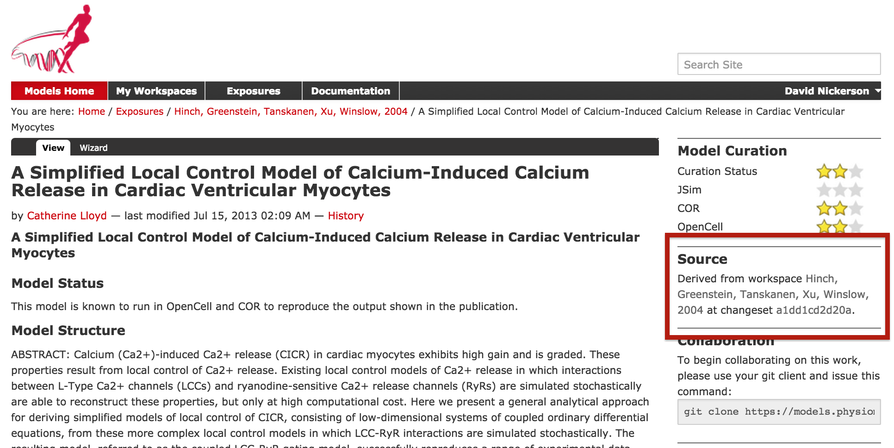

.. _embeddedworkspaces:

==================================
Embedded workspaces and their uses
==================================

.. sectionauthor:: `David Nickerson <http://about.me/david.nickerson>`_

.. todo::
   This section needs more work. Need to add documentation on how to do the examples using a GUI client like TortoiseGit.

:term:`Workspaces` in :term:`PMR` are currently implemented as :term:`Git`
repositories. One Git feature that is quite useful in the context
of the Auckland Physiome Repository is the ability to nest repositories using `Git submodules
<https://git-scm.com/book/en/v2/Git-Tools-Submodules>`_. Using the more
general :term:`PMR2` concepts, we term such nesting as :term:`embedded
workspaces`.

Embedded workspaces:

- are intended to manage the separation of modules or sub-models which are integrated
  to create a model;
- facilitate the sharing and reuse of models and sub-models independently
  from specific instances of a model;
- enable the development of the modules to proceed independently, thus
  the version of the workspaces embedded is also tracked; and
- allow authors to make use of relative URIs when linking between data
  resources providing a file system agnostic method to describe complex
  module relationships in a portable manner.

Workspaces can be embedded at a specific revision or set to track the
most recent revision of the source workspace. Changes made to the source
workspace will not affect any embedding workspace until the author
explicitly chooses to update the embedded workspace. This provides the
author with the opportunity to review the changesets and make an
informed decision regarding alterations to embedded revisions. Any
alterations in the specific revision of an embedded workspace is data
captured in a changeset in the embedding workspace – thus providing a
clear provenance record of the entire dataset in the workspace.

Uses
====

The `Git submodules <https://git-scm.com/book/en/v2/Git-Tools-Submodules>`_ documentation provides detailed information on the use of Git submodules, and the documentation of the `git-submodule <http://git-scm.com/docs/git-submodule>`_ command is also a useful resource.

Making use of a fixed version of a CellML model
-----------------------------------------------

A common use-case for creating an embedded workspace is when you wish to take a curated CellML model from PMR and use it in your own work. Here we demonstrate how to embed a specific version of a workspace within your own workspace. For our example we have our own workspace in which we are developing a cardiac mechanics model and we now want to couple our mechanics model to a model of cardiac calcium dynamics. 

A popular cardiac calcium dynamics model is that of `Hinch et al (2004) <http://identifiers.org/pubmed/15465866>`_. An encoding of this model in CellML can be found in PMR `here <https://models.physiomeproject.org/exposure/8e1a590fb82a2cab5284502b430c4a4f/hinch_greenstein_tanskanen_xu_winslow_2004.cellml/view>`_. From this page, we are able to find two key pieces of information that we need in order to embed this version of the Hinch *et al* model into our workspace, as shown below, the *source workspace* and the *changeset* identifier.

   The Hinch *et al* (2004) exposure page in PMR, highlighting (a) the source workspace; and (b) the changeset identifier.
   

Best practice
=============

