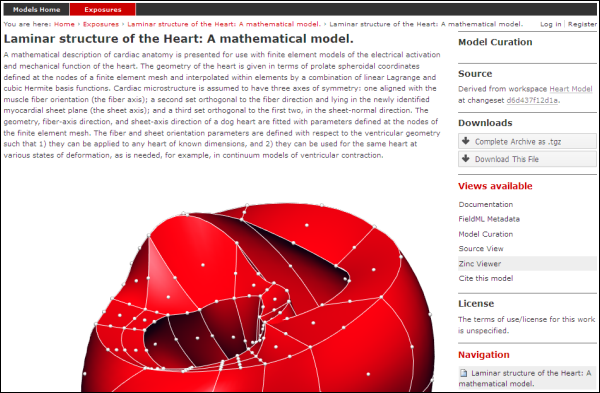
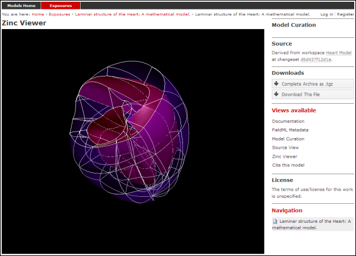

.. _exposing-fieldml:

==========================
Creating FieldML exposures
==========================

.. sectionauthor:: Dougal Cowan

FieldML models in the `Auckland Physiome Repository`_ are presented
through :term:`exposures`.  A FieldML exposure has some similarities to
a CellML exposure - usually consisting of a main documentation page with
some information about the model, accompanied by a range of different
views of the model data and or metadata. FieldML exposures also allow
the real-time three-dimensional display of model meshes within the
browser through the use of the `Zinc plugin`.

.. _Auckland Physiome Repository: https://models.physiomeproject.org
.. _Zinc plugin: http://www.cmiss.org/cmgui/zinc

The example screenshots below show the main documentation page view and
the 3D visualization provided by the Zinc viewer.

   The main documentation view of a FieldML exposure

   The main Zinc viewer view of the same FieldML exposure

Creating the exposure files
===========================

To create a FieldML exposure, the following files will need to be stored
in a workspace in the repository:

- The FieldML model file(s)
- An RDF file containing metadata about the model, and specifying the
  JSON file to be used to specify the visualization.
- The JSON file that specifies the Zinc viewer visualization.
- Optionally, documentation (HTML) and images (PNG, JPG etc).

The following example RDF file from comes from the `Laminar Structure of
the Heart workspace`_ in the repository:

.. _Laminar Structure of the Heart workspace:
   https://models.physiomeproject.org/workspace/heart

.. code-block:: xml
   :linenos:

   <?xml version="1.0" encoding="utf-8"?>
   <rdf:RDF
         xmlns="http://www.w3.org/1999/02/22-rdf-syntax-ns#"
         xmlns:rdf="http://www.w3.org/1999/02/22-rdf-syntax-ns#"
         xmlns:dc="http://purl.org/dc/elements/1.1/"
         xmlns:dcterms="http://purl.org/dc/terms/"
         xmlns:vCard="http://www.w3.org/2001/vcard-rdf/3.0#"
         xmlns:pmr2="http://namespace.physiomeproject.org/pmr2#">
      <rdf:Description rdf:about="">
         <dc:title>
               Laminar structure of the Heart: A mathematical model.
         </dc:title>
         <dc:creator>
            <rdf:Seq>
               <rdf:li>LeGrice, I.J.</rdf:li>
               <rdf:li>Hunter, P.J.</rdf:li>
               <rdf:li>Smaill, B.H.</rdf:li>
            </rdf:Seq>
         </dc:creator>
         <dcterms:bibliographicCitation>
               American Journal of Physiology 272: H2466-H2476, 1997.
         </dcterms:bibliographicCitation>
         <dcterms:isPartOf rdf:resource="info:pmid/9176318"/>
         <pmr2:annotation rdf:parseType="Resource">
            <pmr2:type
                  rdf:resource="http://namespace.physiomeproject.org/pmr2/note#json_zinc_viewer"/>
            <pmr2:fields>
               <rdf:Bag>
                  <rdf:li rdf:parseType="Resource">
                     <pmr2:field rdf:parseType="Resource">
                        <pmr2:key>json</pmr2:key>
                        <pmr2:value>heart.json</pmr2:value>
                     </pmr2:field>
                  </rdf:li>
               </rdf:Bag>
            </pmr2:fields>
         </pmr2:annotation>
      </rdf:Description>
   </rdf:RDF>

This file provides citation metadata and a reference to the resource
that specifies the Zinc viewer JSON file which will be used to describe
the 3D visualisation of the FieldML model. The file breaks down into
three main sections:

- Lines 3-8, namespaces used.
- Lines 10-23, citation metadata.
- Lines 24-37, resource description. Used to specify the JSON file that
  specifies the visualisation.

Example of the JSON file from the same (Laminar Structure of the Heart) workspace:

.. code-block:: js
   :linenos:

   {
       "View" : [
         {
         "camera" : [9.70448, -288.334, -4.43035],
         "target" : [9.70448, 6.40667, -4.43035],
         "up"     : [-1, 0, 0],
         "angle" : 40
         }
       ],
       "Models": [
           {
               "files": [
                   "heart.xml"
               ],
               "externalresources": [
                   "heart_mesh.connectivity",
                   "heart_mesh.node.coordinates"
               ],
               "graphics": [
                   {
                       "type": "surfaces",
                       "ambient" : [0.4, 0, 0.9],
                       "diffuse" : [0.4, 0,0.9],
                       "alpha" : 0.3,
                       "xiFace" : "xi3_1",
                       "coordinatesField": "heart.coordinates"
                   },
                   {
                       "type": "surfaces",
                       "ambient" : [0.3, 0, 0.3],
                       "diffuse" : [1, 0, 0],
                         "specular" : [0.5, 0.5, 0.5],
                       "shininess" : 0.5,
                       "xiFace" : "xi3_0",
                       "coordinatesField" : "heart.coordinates"
                   },
                   {
                       "type": "lines",
                       "coordinatesField" : "heart.coordinates"
                   }
               ],
               "elementDiscretization" : 8,
               "region_name" : "heart",
               "group": "Structures",
               "label": "heart",
               "load": true
           }
      ]
   }

- Lines 2-8, sets up the camera or viewpoint for the initial Zinc viewer
  display.
- Lines 12-18, specifies the FieldML model files
- Lines 19-41, set up the actual visualisations of the mesh - in this
  case, two different surfaces and a set of lines.
- Lines 42-46, specify global visualisation settings.

For more information on these settings, please see the cmgui documentation.

.. note::
   The specifics of these RDF and JSON files are a work in progress, and
   may change with each new version of the Zinc viewer plugin
   or :term:`PMR2`.

Creating the exposure in the Auckland Physiome Repository
=========================================================

First you will need to create a workspace to put your model in,
following the process outlined in the document on working with
workspaces.

- Upload your FieldML model files and Zinc viewer specification files.
- Find revision of workspace you wish to expose and create exposure

Exposure wizard procedure
-------------------------

View generator as per CellML; select HTML annotator and HTML doc file

New exposure file entry: select .rdf file and select FieldML (JSON)
type. Click *Add*.

- Documentation file - same as above
- Curation flags - none (should be removed?)
- No other settings

Click *Update*.

Click *Build*.

To see the 3D visualisation, you will need to have the `latest Zinc
plugin <http://www.cmiss.org/ReleaseCenter/zinc/releases>`_ installed.
