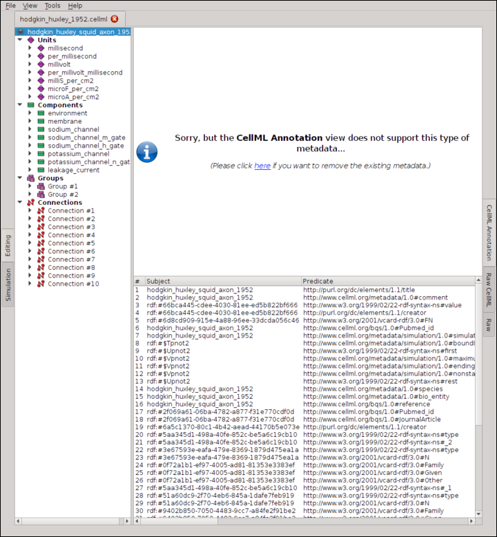
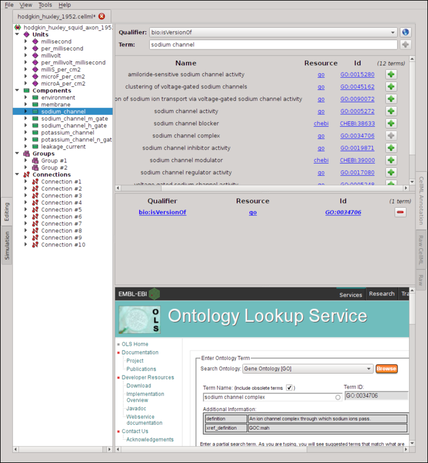
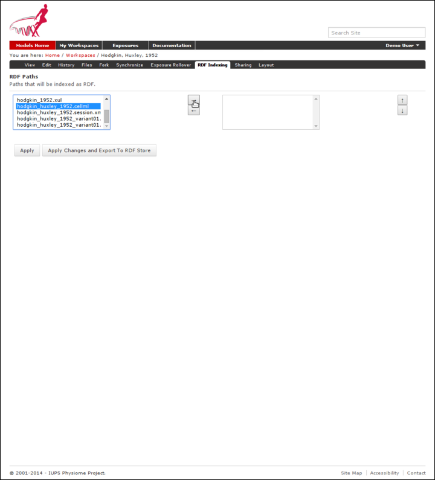
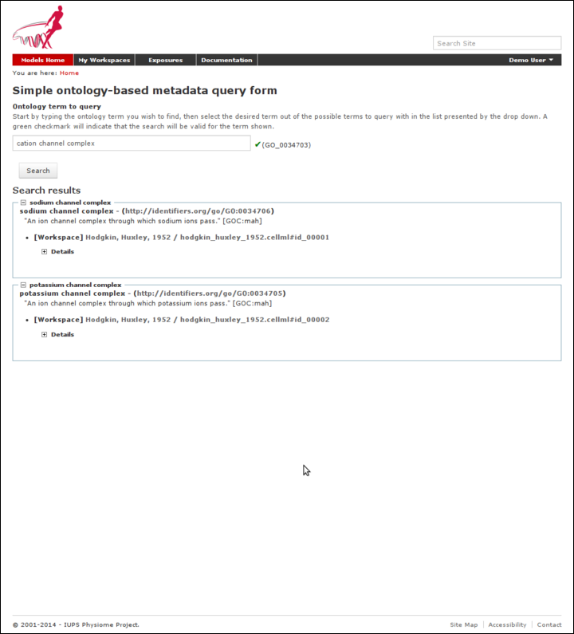

.. _semantic-metadata:

==============================
Working with semantic metadata
==============================

.. sectionauthor:: Tommy Yu

PMR2 release 8 and 9 brought in the support for semantic metadata, which
allows users to add whatever metadata and annotations they might have
stored into the repository into the underlying metadata semantic engine,
which then allows them to be retrieved using search queries.  In this
section, we will go over how to use OpenCOR to annotate a model, and how
to add the metadata to the underlying metadata engine then query for the
results.

Preparation
===========

In this section, we assume that you have already run through the 
:ref:`tutorial on using the repository <cellmlrepositorytutorial>` for
the basic operations of the repository.

For the tutorial, we will use a :term:`fork` of the the `Hodgkin,
Huxley, 1952 workspace`_.  If you need a quick reminder on how you might
do this, please see :ref:`this section of the tutorial
<tut1forkingaworkspace>`.

.. _Hodgkin, Huxley, 1952 workspace: http://teaching.physiomeproject.org/workspace/hodgkin_huxley_1952

Once you forked that workspace, you should now clone that workspace onto
your system.  If you need help on this, please refer to :ref:`this help
on cloning a workspace <tut1cloningworkspace>`.

Using OpenCOR for model annotation
----------------------------------

Use OpenCOR to open your local clone of your model file, specifically
the ``hodgkin_huxley_1952.cellml`` file.

Select the ``sodium_channel`` component under the list of components,
then click on the helpful link to remove the existing metadata for that
node.

In the dropdown menu of *Qualifiers*, select bio:isVersionOf

In the textbox *Term*, type in "sodium channel", as the component is
named so.  Wait for the possible terms to be retrieved and populated by
OpenCOR.

Once that is done, hit the green '+' button for the "sodium channel
complex" (GO:0034706) to denote that the component is a version of this
term.

Now select the ``potassium_channel`` component, and repeat the processs
to annotate this with the "potassium channel complex" term.

Once you are done, save your changes, commit and push your work back
into your private fork.  Again, refer to the tutorial linked in the
preparation section if you need a primer.

Getting your workspace indexed by the repository
================================================

Now that your changes have been pushed back, go back to the page for your
fork of the model and select the "RDF Indexing" tab.

Scroll down the left-handed list until you see the
``hodgkin_huxley_1952.cellml`` file, select it, then push the button
with the right arrow on it to add it onto the list of paths to be
tracked, then select the "Apply Changes and Export To RDF Store" button.

Go back to the main page, select the "Ontology based search engine" link
at the bottom, then enter the relevant search term.  As there are
limited reasoning capabilities built into the current iteration of the
search engine, you may enter a term one level up above the terms we
annotated the model with.  For our example, please enter "cation channel
complex" into the search box, select the term ending with (GO_0034703).
The search indicator will give a green checkmark and now you may select
the "Search" button.  The search result will now list the workspace and
the file that contain this annotation.

