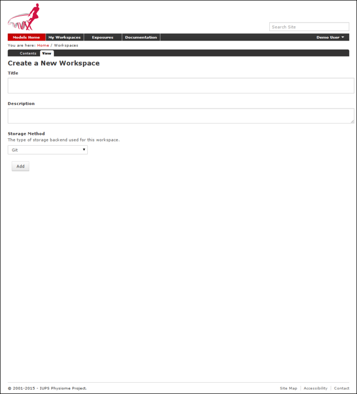

.. _workingwithworkspaces:

=======================
Working with workspaces
=======================

.. sectionauthor:: David Nickerson

.. _teaching instance: http://teaching.physiomeproject.org/

All models in the Auckland Physiome Repository exist in
:term:`workspaces`, which are :term:`Mercurial` repositories that can be
used to store any kind of file. Mercurial is a distributed version
control system (DVCS).

In order to create your own workspaces, you will first need to create a
repository account by registering at `models.physiomeproject.org
<https://models.physiomeproject.org>`_. Near the top right of the
repository page there will be links labelled *Log in* and *Register*.
Click on the register link, and follow the instructions.

Workspaces in the Auckland Physiome Repository are permanent once they
are created. There is a `teaching instance`_ of the repository which may
be used for *experimenting* with features of the software without
worrying about creating permanent workspaces that might have errors in
them.  Users accounts and data from the Auckland Physiome Repository
will be copied to the `teaching instance`_ periodically, overwriting all
data there in the process, but users may register for an account just on
the `teaching instance`_ if they prefer.  Such accounts will need to be
recreated each time the teaching instance is overwritten.

.. include:: teaching-instance-warning.rst

.. _creatingNewWorkspace:

Creating a new workspace
========================

Once a user is logged into Auckland Physiome Repository, they will be
presented with a :guilabel:`My Workspaces` link in the top toolbar, as
shown below:

.. figure:: images/my-workspaces.png
   :align: center

The first paragraph includes a link to your dashboard to add a new
workspace, shown below:

Currently :term:`Mercurial` is the only avialable option for the storage
method for a new workspace, but this may be expanded to include other
storage methods in future.  A workspace should be given a meaningful
title and a brief description to help locate the workspace using the
repository search.  Both these fields can be edited later, so don't worry
if you don't get it perfect the first time.

Clicking the :guilabel:`Add` button with then create the workspace,
which will initially be empty, as shown below:

.. figure:: images/new-workspace.png
   :align: center

In the figure above, the URI of the newly created workspace has been
highlighted. This is the URI that will be used when operating on the
workspace using Mercurial.

.. _sharingWorkspaces:

Working with collaborators
==========================

The repository makes use of :term:`Mercurial` to manage individual
workspaces.  Mercurial is a Distributed Version Control System (DVCS),
and as such encourages collaborative development of your model, dataset,
results, *etc*. Using Mercurial, each member of the development team is
able to have their own clone of the workspace which can be kept
synchronized with the other members of the development team, while
ensuring that each team member's contributions are accurately recorded
in the workspace history.

Once a :term:`workspace` has been published, any registered users (or
members) of the repository is able to access and clone the workspace,
including team members and the anonymous public. Only the owner and
those with privileges granted by the owner are able to make changes to
the workspace, including :term:`pushing` changes into the Mercurial
repository.  Private workspaces, however, can only be viewed by its
owner and those with viewing privileges granted by its owner.

Auckland Physiome Repository provides access controls to manage the
ability of its members and anonymous users to interact with workspaces.
The access control is managed via the :guilabel:`Sharing` tab for a
given workspace, as shown below.

By default, you will initially see that all logged-in user has the
**Can add** permission.  That is the inherited permission from the
global workspace container, and does not imply that they can view your
work as that is determined by the **Can view** permission.  This also
does not mean that they can add data to your workspace.  This permission
setting is applied to the default workspace container so that you and
all other users of the system have the ability to create new workspaces.

:term:`PMR2` has the option to provide individual containers per user
for their private workspaces, but this option is now disabled in the
Auckland Physiome Repository.

You can disable the inherited higher level permissions from your
workspace by unchecking the **Inherit permissions from higher levels**
checkbox, if you wish, but the administrators of the repository can
access your workspace regardless if you wish for them to aid you with
your workspace.  Using the :guilabel:`Sharing` tab you are able to
search for other members, such as the names of people in your
development team.  These members would then appear in the list of
members and you are able to set their access as required.

Using the :guilabel:`Sharing` controls there are currently four possible
permissions that can be controlled. The **Can add** and **Can edit**
permissions relate to the object that represents the workspace in the
website database and are generally left in the default state. When
selected for a given member, the **Can view** permission allows that
member to view the workspace on the website, even if the workspace is
private. Similarly, when the **Can hg push** permission is enabled the
selected member is able to :term:`push` into the workspace - this is the
most important permission as enabling this allows members to add,
modify, and delete the actual content of the workspace. One benefit of
using Mercurial means that even if one of the privileged members
accidentally modifies the workspace in a detrimental manner, it is
possible to revert the workspace back to the correct state.

When working in a collaborative team you would generally enable the
**Can hg push** and **Can view** permissions for all team members and
only enable the **Can add** and **Can edit** permissions for the team
members responsible for the workspace presentation in the website.

Uploading files to your workspace
=================================

The basic process for adding content to a :term:`workspace` consists of
the following steps:

#. :term:`Clone` the workspace to your local machine.
#. Add files to cloned workspace.
#. Commit the files using a :term:`Mercurial` client.
#. :term:`Push` the workspace back to the repository.

An example demonstrating these steps can be found in in this tutorial
step: `Populate with content`_

.. _Populate with content: http://abibook2.readthedocs.org/en/latest/tutorials/embc13/scenario1/opencor/#embc13-opencor-addingcontent
